# NJK Dynamics: Master Context

Este documento estabelece o contexto mestre, a arquitetura de dados, a identidade visual e as diretrizes técnicas do ecossistema NJK Dynamics. Ele funciona como a única fonte de verdade (Single Source of Truth - SSOT) para integração de sistemas, desenvolvimento de novos módulos e alinhamento conceitual por agentes humanos ou inteligências artificiais.

---

## 1. Visão Geral do Ecossistema

A **NJK Dynamics** é um ecossistema de micro-aplicativos (micro-apps) integrados, projetado para otimizar e automatizar rotinas administrativas, financeiras e operacionais, com foco específico no setor corporativo e agroindustrial (Agro). 

Em vez de uma única plataforma monolítica e complexa, a arquitetura adota a filosofia de ferramentas modulares focadas. Cada micro-app resolve um problema de negócios de ponta a ponta e se integra perfeitamente com os demais módulos através de uma camada compartilhada de dados.

O **NEXUS** serve como o portal inicial unificado de controle e autenticação de todo o ecossistema.

---

## 2. Identidade Visual (UI/UX Design System)

A interface de usuário (UI) do ecossistema segue uma linguagem conceitual unificada de alta fidelidade visual, com foco em estética premium e imersão técnica.

### Diretrizes Estéticas:
* **Tema Principal (Dark/Cyber-Tech):** Ambiente de trabalho em modo escuro absoluto.
  * *Base do Fundo (`--bg-base`):* `#080c14` (azul espacial ultra-escuro).
  * *Superfícies de Componentes (`--bg-surface`):* `#0d1420`.
  * *Cards de Conteúdo (`--bg-card`):* `#111827`.
* **Cores de Destaque e Acentos Neon:**
  * *Gradiente de Marca (Brand Gradient):* `#2563eb` (azul cobalto) a `#7c3aed` (roxo elétrico) em ângulo de 135 graus.
  * *Cores de Destaque Adicionais:* Cyan elétrico (`#06b6d4`), Verde Esmeralda (`#10b981`), Âmbar (`#f59e0b`) e Rosa (`#f43f5e`).
* **Efeitos de Profundidade (Glassmorphism & Glow):**
  * Uso de holofotes radiais difusos (`radial-gradient`) com baixa opacidade (`rgba(37,99,235,0.12)`) no topo esquerdo do background para simular iluminação traseira de interfaces físicas.
  * Bordas sutis (`#1e2d45`) que se transformam em brilhos neon específicos de cada app (ex: `rgba(6,182,212,0.45)` para Dataware) ao receber hover.
* **Tipografia:**
  * *Interface e Textos Principais:* **Inter** (peso de 300 a 800) para legibilidade moderna.
  * *Dados e Métricas Técnicas:* **JetBrains Mono** para exibir IDs identificadores, estatísticas, datas e registros.

---

## 3. Arquitetura de Dados (SSOT - Single Source of Truth)

O ecossistema adota a arquitetura de **Tabela Dimensional Centralizada** para evitar a redundância de cadastros e manter a consistência de registros. O portal **NEXUS** funciona como a casca controladora dos micro-aplicativos.

```mermaid
graph TD
    NX[NJK NEXUS Portal] -->|Autenticação & Navegação| DW[NJK Dataware]
    NX -->|Autenticação & Navegação| AA[AgroAta App]
    NX -->|Autenticação & Navegação| FL[Finalyze App]
    DB[(Supabase Central)] <--> DW
    DW -->|dim_clientes / dim_empresas| AA
    DW -->|dim_clientes / dim_empresas| FL
    
    style NX fill:#080c14,stroke:#7c3aed,stroke-width:2px,stroke-dasharray: 5 5;
    style DB fill:#0d1420,stroke:#2563eb,stroke-width:2px;
    style DW fill:#111827,stroke:#06b6d4,stroke-width:2px;
    style AA fill:#0d1420,stroke:#10b981,stroke-width:1px;
    style FL fill:#0d1420,stroke:#f59e0b,stroke-width:1px;
```

### O Papel do NJK Dataware
O **NJK Dataware** é o repositório centralizado e a engrenagem SSOT do ecossistema. Hospedado em um banco de dados relacional **Supabase**, ele armazena as **Dimensões Corporativas de Base**:
* `dim_clientes` (dados cadastrais de produtores rurais e clientes).
* `dim_empresas` (entidades corporativas e filiais).
* `dim_contratos` (estruturas contratuais bases).

> [!IMPORTANT]
> **Consumo Mandatório:** Nenhum outro micro-app do ecossistema (como AgroAta ou Finalyze) deve possuir um cadastro paralelo de clientes ou empresas. Todos os aplicativos obrigatoriamente consomem os identificadores únicos (`cliente_id`, `empresa_id`) gerados pela API do Dataware. Isso previne a divergência de dados cadastrais.

---

## 4. Módulos do Ecossistema

### A. NEXUS (Portal Central de Aplicativos)
* **Função:** Dashboard inicial unificado com controle de acesso (Login Restrito via senha), monitoramento de saúde da API central em tempo real, relógio atualizado em segundos, Toasts de notificação e grid responsivo estruturado com capacidade para até 12 módulos (3 ativos e 9 placeholders "Em Breve").
* **Componente de Integração:** Realiza chamadas assíncronas assinaladas com limites de timeout de rede para exibir Quick Stats atualizados.

### B. Dataware (Gestão de Dimensões)
* **Função:** Interface administrativa para cadastro, exclusão, auditoria e sincronização das dimensões fundamentais (`dim_clientes`, `dim_empresas`, etc.) com o Supabase.
* **Componente de Integração:** Disponibiliza a `NJK Core API` com endpoints de leitura/escrita e health checks automáticos de latência.

### C. AgroAta (Gerador de Atas Técnicas)
* **Função:** Geração simplificada de atas técnicas de reuniões operacionais com produtores rurais em campo.
* **Fluxo de Dados:** Consome o `cliente_id` e dados de dimensão do Dataware para preenchimento do cabeçalho.
* **Entrega:** Compila as pautas da reunião, assinaturas e resoluções técnicas em um documento PDF formalizado de alta qualidade.

### D. Finalyze (Processamento de Financiamentos)
* **Função:** Auditoria financeira de contratos e cálculo de juros e amortizações de financiamentos bancários.
* **Integrações Avançadas:**
  * Processador OCR integrado para leitura e extração de metadados diretamente de PDFs digitalizados de cédulas de crédito bancário.
  * Consome o cadastro do cliente via `cliente_id` do Dataware.
* **Entrega:** Emite relatórios financeiros analíticos complexos e tabelas pivotadas contendo as divergências de cobrança e taxas reais apuradas.

---

## 5. Diretriz de Output (Foco no Entregável)

Uma regra de design imutável para os aplicativos do ecossistema NJK Dynamics é o **foco em entregáveis de alto valor perceptível para o cliente final**:

> [!TIP]
> Todo micro-app deve ser projetado com foco na saída final. O usuário insere dados, realiza análises ou gera informações, mas o ciclo só se completa com a geração de um **PDF ou relatório esteticamente refinado, limpo e estruturado**. Esse entregável representa o produto final da NJK Dynamics e deve ser visualmente consistente com a qualidade premium do ecossistema.

---

## 6. Stack Técnica Homologada

Para garantir estabilidade, escala global sob demanda e facilidade de manutenção por microsserviços, a stack de infraestrutura e serviços foi restrita aos seguintes provedores:

| Serviço / Camada | Provedor de Tecnologia | Função |
| :--- | :--- | :--- |
| **Versionamento & Git** | **GitHub** | Controle de código-fonte de todos os micro-apps. |
| **Banco de Dados & Auth** | **Supabase** | Armazenamento de dados SQL, SSOT, políticas de RLS e microsserviços do backend de dimensão. |
| **Hospedagem Backend / APIs**| **Render** | Execução de microsserviços em Python (FastAPI/Flask) e tarefas de OCR. |
| **Hospedagem Frontend** | **Vercel** | Distribuição CDN global estática de alta performance para os painéis Web de cada app. |
